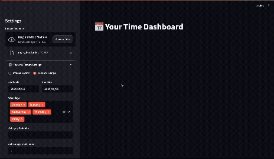

# Time Analyzer Dashboard

*A Streamlit web application to analyze and visualize your personal time management data from a Google Calendar export (.ics file).*

<!-- It's highly recommended to add a screenshot of your app here -->

<div align="center">
  
</div>


## Features

* **ICS Parser**: Ingests `.ics` calendar files, correctly handling both single and recurring events.
* **Customizable Rules**: Configure parsing rules, category delimiters, weekday/weekend definitions, and "focus session" criteria directly in the UI.
* **Interactive Dashboard**: A clean, modern UI to explore and analyze your calendar data.
* **Insightful Visualizations**:

  * **Time per Category**: Stacked bar chart of time spent on categories/subcategories.
  * **Weekday vs. Weekend**: Comparison of time allocation.
  * **Hierarchical Sunburst**: Visual breakdown of categories.
  * **"Average Day" Summary**: Pie chart of your average day distribution.
  * **Activity Heatmap**: Displays busiest/freest hours by category and weekday.

## How It Works

The project is split into two main components:

* **`runner.py`**: A CLI utility that:

  * Parses `.ics` files and expands recurring events.
  * Applies user-defined rules to tag and categorize events.
  * Enriches data.
  * Outputs a clean `calendar.csv` file.

* **`app.py`**: A Streamlit frontend that:

  * Lets users upload `.ics` files and configure settings.
  * Executes `runner.py` as a subprocess.
  * Loads `calendar.csv` and renders interactive visualizations.

## Category System
* By default, this tool uses a colon and dash-delimited system to extract categories and subcategories from your event titles. For example:
```text
Work: Deep Focus - Coding
Personal: Health - Gym
Study: Math - Linear Algebra
```

### Fully Customizable
* You don’t need to follow this default structure. In the app’s sidebar, you can:
  * Change the category delimiter (default is :)
  * Change the subcategory delimiter (default is -)
  * Ignore or flatten categories if you prefer a simpler setup
* This flexibility lets you adapt the parser to your personal naming conventions—whether simple (Work) or detailed (Work | Project A | Sprint Review).

##  Setup and Installation

### Prerequisites

* Python 3.8+
* A Google Calendar export file (`.ics`)

### 1. Clone the repository

```bash
git clone https://github.com/n9ety/time_management_panel.git
cd time_management_panel
```

### 2. Create and activate a virtual environment

**macOS/Linux:**

```bash
python3 -m venv venv
source venv/bin/activate
```

**Windows:**

```bash
python -m venv venv
.\venv\Scripts\activate
```

### 3. Install dependencies

install dependencies:

```bash
pip install -r requirements.txt
```

##  Usage

1. **Export your calendar**:

   * Go to [Google Calendar Settings](https://calendar.google.com/).
   * Select your calendar → Settings → Export.
   * This will download a `.zip` file containing the `.ics`.

2. **Place the file**:

   * Unzip the `.zip` and place the `.ics` file in the `data/ics/` directory.

3. **Run the app**:

```bash
streamlit run src/app.py
```

4. **Analyze**:

   * The app will open in your browser.
   * Use the sidebar to configure parsing options.
   * Click **Analyze My Time** to generate insights.

   

---

## Folder Structure

```
.
├── data/
│   ├── ics/
│   └── csv /             
├── src/
│   ├── app.py             # frontend
│   └── runner.py          # processing
├── requirements.txt
└── README.md
```

---

